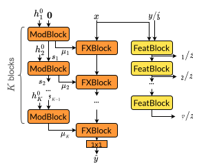
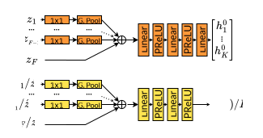
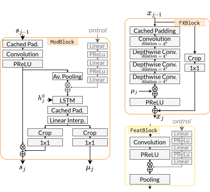

# Series-Parallel Time-Variant Modulation (SPTVMod)

This repository contains the PyTorch implementation of SPTVMod used for the December 2025 pre-print paper *Time-Varying Audio Effect Modeling By End-to-End Adversarial Training* authored by Y. Bourdin, P. Legrand and F. Roche.

## Architecture

|  |  |
| :---: | :---: |
| (1a) | (1b) |

*Figure 1*. Block diagram of the architecture of SPTVMod. The generator has an orange background, and the discriminator a yellow one.

\
 \
*Figure 2b*. Composition of the processing blocks: ModBlock (left), FXBlock (upper right) and FeatBlock (lower right).

## Training

- Use the `set_target_length()` method to compute:
    - the expected input length for the specified target length;
    - the index intervals to slice the tensors given to different parts of the model, here the modulation path and audio path;
    - the cropping sizes of the cropping layers.
- To obtain the generator's output, call `forward()` with `paddingmode = CachedPadding1d.NoPadding`, and `use_spn = True` if using state prediction.
- To obtain the discriminator's outputs, compute the feature lists of the true and predicted outputs with `disc_features` and use `disc_from_features()` method to obtain the discriminator's outputs.

## Computing the slicing indices and the cropping sizes

This computation is unchanged from SPTMod: [https://github.com/ybourdin/sptmod?tab=readme-ov-file#computing-the-slicing-indices-and-the-cropping-sizes](https://github.com/ybourdin/sptmod?tab=readme-ov-file#computing-the-slicing-indices-and-the-cropping-sizes)

## Dataset

The Fast-LFO and Slow-LFO datasets we used for our experiments are available in the folders `dp4_fast_lfo_dataset` and `dp4_slow_lfo_dataset`.